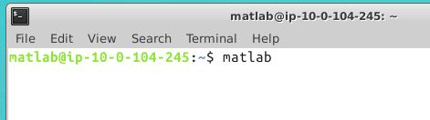

# MATLAB on Microsoft Azure

# Requirements
Before starting, you will need the following:

- A MATLAB® license. For more information, see [Configure MATLAB License in the Cloud](http://inside.mathworks.com/tl?oM7ZtgRFtk).
- A [MathWorks Account](https://www.mathworks.com/login?uri=%2Fmwaccount%2F).
- A Microsoft Azure account.

# Costs

You are responsible for the cost of the Azure services used when you create cloud resources using this guide. Resource settings, such as instance type, will affect the cost of deployment. For cost estimates, see the pricing pages for each Azure service you will be using. Prices are subject to change.

# Introduction
The following guide will help you automate the process of running the MATLAB desktop on Microsoft Azure and connect to it using the Remote Desktop Protocol (RDP). The automation is accomplished using an Azure Resource Manager (ARM) template. The template is a JSON
file that defines the resources needed to run MATLAB on Azure. For information about the architecture of this solution, see [Architecture and Resources](#architecture-and-resources).

# Deployment Steps

## Step 1. Launch the Template
Click the **Deploy to Azure** button to deploy MATLAB on
    Azure. This will open the Azure Portal in your web browser.

> VM Platform: Ubuntu 16.04

> MATLAB Release: R2018a

<!--
Use this guide to automate the process of launching a MATLAB desktop running on Azure Compute resources in your Microsoft Azure Account.

Click the button below to open the Azure Portal with pre-configured settings with Ubuntu 16.04 and MATLAB 2018a.

After you click the Deploy To Azure button above, the “Custom deployment” page will open in your browser where you can configure the parameters. It is easier to complete the steps if you position these instructions and the Azure Portal window side-by-side.

1. Specify and check the defaults for these cluster parameters:

    | Parameter label                                    | Description 
    | -------------------------------------------------- | ----------- 
    | Subscription (required)                            | Choose an Azure subscription to use for purchasing cluster  resources.
    | Resource group (required)                          | Choose a name for the resource group that will hold the cluster resources. It is recommended to create a new resource group for each deployment. This allows all resources relating to that cluster to be deleted simultaneously.
    | Location (required)                                | Choose the region to start resources in. Ensure that you select a location which supports your requested instance types. To check which services are supported in each location, see [Azure Region Services](https://azure.microsoft.com/en-gb/regions/services/). 
    | Instance type (required)              |Choose the Azure instance type to use for the MATLAB Virtual Machine. All Azure instance types are supported.(https://docs.microsoft.com/en-us/azure/virtual-machines/windows/acu) for details on vCPUs for each instance type. 
    | IP address range of client (required)              | Specify your IP address range that can be used to access the cluster using SSH and use the form x.x.x.x/x. In a web browser search for "my ip address", copy and paste the address into the input box. Append "/32" to restrict access to your address only, or specify a CIDR range.
    | Admin username (required)                          | Choose the admin username. This username is required when logging into any instance using remote desktop protocol. 
    | Admin password (required)                          | Choose the admin password. This password is required when logging into any instance using remote desktop protocol. For the deployment to succeed, your password must meet [Azure's password requirements](https://docs.microsoft.com/en-us/azure/virtual-machines/windows/faq#what-are-the-password-requirements-when-creating-a-vm).

2. Tick the box to accept the Azure Marketplace terms and conditions.

3. Click the "Purchase" button.

When you click Purchase, the Virtual Machine and required resource are created using Azure template deployments. Template deployment can take several minutes.

After creating the cluster you can connect to it from your desktop MATLAB by using Remote Desktop Software.
-->
## Step 2. Configure Cloud Resources
Provide values for parameters in the custom deployment template on the Azure Portal :

| Parameter Name          | Value                                                                                                                                                                                                                                                                                                                                                                                                                                                                                                                                                                                |
|-------------------------|--------------------------------------------------------------------------------------------------------------------------------------------------------------------------------------------------------------------------------------------------------------------------------------------------------------------------------------------------------------------------------------------------------------------------------------------------------------------------------------------------------------------------------------------------------------------------------------|
| **Subscription**            | Choose an Azure subscription to use for purchasing resources.
<em>Example:</em> Massachusetts
                                                                                                                                                                                                                                                                                                                                                                                                                                                                            |
| **Resource group**          | Choose a name for the resource group that will hold the resources. It is recommended you create a new resource group for each deployment. This allows all resources in a group to be deleted simultaneously. 
<em>Example:</em> Boston311
                                                                                                                                                                                                                                                                       |
| **Location**                | Choose the region to start resources in. Ensure that you select a location which supports your requested instance types. To check which services are supported in each location, see [Azure Region Services](<https://azure.microsoft.com/en-gb/regions/services/>). We recommend you use East US or East US 2. 
<em>Example:</em> East US
                                                                                                                                                                                                                          |
| **VM Size**                 | Specify the size of the VM you plan on using for deployment. Use [MATLAB system requirements](https://www.mathworks.com/support/sysreq.html) as a guide in choosing the appropriate VM size. The template defaults to: *Standard_D3_v2*. This configuration has 4 vCPUs and 14 GiB of Memory. For more information, see Azure [documentation](https://docs.microsoft.com/en-us/azure/virtual-machines/windows/sizes-general). 
<em>Example:</em> Standard_D3_v2
 |
| **Client IP Addresses**     | This is the IP address range that will be allowed to connect to this instance using the Remote Desktop Protocol. The format for this field is IP Address/Mask. 
<em>Example</em>: 
10.0.0.1/32 <ul><li>This is the public IP address which can be found by searching for "what is my ip address" on the web. The mask determines the number of IP addresses to include.</li><li>A mask of 32 is a single IP address.</li><li>Use a [CIDR calculator](https://www.ipaddressguide.com/cidr) if you need a range of more than one IP addresses.</li><li>You may need to contact your IT administrator to determine which address is appropriate.</li></ul>
 |
| **User Name**               | Enter a username you would like to use to connect to the virtual machine in the cloud using remote desktop.                                                                                                                                                                                                                                                                                                                                                                                                                                                                                                                                                 |
| **User Password**           | Enter a password you would like to use to connect to the virtual machine in the cloud using remote desktop.                                                                                                                                                                                                                                                                                                                                                                                                                                                                                  

 

Agree to the Azure Marketplace terms and conditions and click **Purchase** to begin the deployment. Creating a resource group on Azure can take at least 10 minutes.

## Step 3. Connect to the Virtual Machine in the Cloud

>   **Note:** Complete these steps only after your resource group has been successfully created.

1.  In the Azure Portal, on the navigation panel on the left, click **Resource
    groups**. This will display all your resource groups.

2.  Select the resource group you created for this deployment from the list. This
    will display the Azure blade of the selected resource group with its own
    navigation panel on the left.

3.  Select the resource labeled **matlab-public-ip**. This resource
    contains the public IP address to the virtual machine that is running MATLAB. 
    

4.  Copy the IP address from the IP address field.

5.  Launch any remote desktop client, paste the IP address in the appropriate field, and connect. On the Windows Remote Desktop Client you need to paste the IP address in the **Computer** field and click **Connect**.

6. In the login screen that's displayed, use the username and password you specified while configuring cloud resources in [Step 2](#step-2-configure-cloud-resources).

## Step 4. Launch MATLAB

Double-click the MATLAB icon on the instance desktop to launch MATLAB. The first time you start MATLAB you will get a login dialog. Enter a valid MathWorks Account email address and password and click **Sign In**. If you have the correct license rights, MATLAB starts. For more information, see [Configure MATLAB License in the Cloud](http://inside.mathworks.com/tl?oM7ZtgRFtk).

>**Note**:It may take a few minutes for activation to complete and MATLAB to start. You will experience this delay only the first time you start MATLAB.

<!--
# Activate and Launch MATLAB

1. After clicking "Purchase" you will be taken to the Azure Portal Dashboard. To montior the progress of your deployment, select your cluster resource group from the Resource Groups panel. Wait for the all "Deployments" to reach "Succeeded".

1. You'll need the DNS entry assigned to the instance to connect. Within the resource group locate the matlab-publicIP resource and click on it.  Copy the DNS name.

    

1. Launch the Remote Desktop Client, paste the DNS name and click connect.
  
    

1. You should see the login screen. Login with the Admin username and password and click "OK".

    

1. Open a terminal window, type *matlab* and press **Enter**.  It may take a minute or two for the first launch of MATLAB to prompt you to activate.

    

1. Once the Activaion client launches, walk through the activation steps <**link to activation instructions**>

1. After the Activation client closes enter *matlab* at the terminal prompt again.  This will launch MATLAB.  If you chose *Log in each time* you'll be prompted for a user name and password.  Enter your MathWorks Account credentials and **Log in**.  MATLAB may take a few minutes to load the first time.

    
-->
# Additional Information

## Delete Your Resource Group
You can remove the resource group and all associated cluster resources when you
are done with them. Note that there is no undo.

1.  Login to the Azure Portal.
2.  Select the resource group containing your cluster resources.
3.  Select the **Delete resource group** icon to destroy all resources deployed
    in this group.
4.  You will be prompted to enter the name of the resource group to confirm the
    deletion.

<!--
# Delete Your Deployment
You can remove the Resource Group and all associated resources when you are done with them. Note that there is no undo. After you delete any files stored locally to the VM will no longer exist.
1. Login to the Azure Portal.
2. Select the Resource Group containing your cluster resources.
3. Select the "Delete resource group" icon to destroy all resources deplyoyed in this group.
4. You will be prompted to enter the name of the resource group to confirm the deletion.

# Troubleshooting
If your resource group fails to deploy, check the Deployments section of the cluster Resource Group. It will indicate which resource deployments failed and allow you to navigate to the causing error message.

-->
## Architecture and Resources
Deploying this reference architecture will create several resources in your
resource group.

Deploying this reference architecture sets up a single Azure virtual machine running Linux and MATLAB, a network interface with a public IP address to connect to the virtual machine, a network security group that controls network traffic, and a virtual network for communication between resources. 

A preconfigured Ubuntu 16.04 VM is provided to make deployment easy. The VM image contains the following software:
* MATLAB, Simulink, Toolboxes, and support for GPUs.
To see a list of installed products, type `ver` at the MATLAB command prompt.
 
* Add-Ons: Neural Network Toolbox Model for AlexNet Network, Neural Network Toolbox Model for GoogLeNet Network, and Neural Network Toolbox(TM) Model for ResNet-50 Network

### Resources

| Resource Name                     | Resource Name in Azure  | Number of Resources | Description                                                                                |
|-----------------------------------|-------------------------|---------------------|--------------------------------------------------------------------------------------------|
| Virtual Machine                 | `matlab-vm`            | 1                   | The virtual machine instance with pre-installed desktop MATLAB.|
| Network interface                 | `matlab-nic`            | 1                   | Enables the virtual machine to communicate with internet, Azure, and on-premises resources.|
| Public IP address                 | `matlab-publicIP`       | 1                   | Public IP address to connect to the virtual machine running MATLAB.                        |
| Network security group            | `matlab-rdp-nsg`        | 1                   | Allows or denies traffic to and from sources and destinations.                             |
| Virtual network                   | `matlab-vnet`           | 1                   | Enables resources to communicate with each other.                                          |
| Disk                 | `matlab-vm-disk-<unique id>`            | 1                   | The disk attached to the VM.|
| Image                 | `matlab-base-image`            | 1                   | The original image used to create the VM.|

<!--
# Learn About MATLAB on Azure Architecture

(insert about MATLAB blurb here)

Microsoft Azure is a set of cloud services which allow you to build, deploy, and manage applications hosted in Microsoft’s global network of data centres. This document will help you launch a compute cluster running MDCS and MJS using compute, storage, and network services hosted by Azure. For more information about the range of services offered by Microsoft Azure, see [Azure Services](https://azure.microsoft.com/en-gb/services/). Services launched in Azure can be created, managed, and deleted using the Azure Portal UI. For more information about the Azure Portal, see [Azure Portal](https://azure.microsoft.com/en-gb/features/azure-portal/). 

The MJS cluster and the resources required by it are created using [Azure Resource Manager templates](https://docs.microsoft.com/en-gb/azure/azure-resource-manager/resource-group-overview). The cluster architecture created by the template is illustrated in Figure 2, it defines the resources below. For more information about each resource see the [Azure template reference.](https://docs.microsoft.com/en-us/azure/templates/) 

### Networking resources
* Virtual Network (Microsoft.Network/virtualNetworks) The Virtual Network includes the following components:
    * Subnet (Microsoft.Network/virtualNetworks/subnets)
    * Network Security Group (Microsoft.Network/networkSecurityGroups) : Ingress rules from client IP address:
        * Allow 22:  Required to connect using SSH.
        * Allow 3389: Required for Remote Desktop Protocol.
* Each instance deployed to the Virtual Network will create the following:
    * Network interface (Microsoft.Network/networkInterfaces)
    * Public IP Address (Microsoft.Network/publicIPAddresses)
    
### Instances
* MATLAB instance (Microsoft.Compute/virtualMachines): A Compute instance with a desktop MATLAB installed. The MATLAB install is part of the VM image
-->

## FAQ

### How do I save my changes in the VM?
All your files and changes are stored locally on the virtual machine.  They will persist until you either terminate the virtual machine instance or delete the resource group.  Stopping the instance does not destroy the data on the instance.  If you want your changes to persist before you terminate an instance you’ll need to:
* copy your files to another location, or  
* create an image of the virtual machine.

### What happens to my data if I shutdown the instance?
You may want to shutdown the instance when you aren’t using it.  Any files or changes made to the virtual machine will persist when shutting down and will be there when you restart. 

### How do I save an image?
You can save a copy of your current virtual machine.  Locate the Azure VM in your resource group in the Azure Portal, click “Capture Image” and follow the instructions. 

### How do I customize the image?
You can customize an image by launching the reference architecture, applying any changes you want to the virtual machine such as installing additional software, drivers and files and then saving an image of that virtual machine using the Azure Portal. For more information, see [How do I save an image?](#how-do-i-save-an-image). When you launch the reference architecture, click “Edit Template”, replace the `baseImageUri` in the “variables” section with the URL from your custom image. Save and finish the deployment steps by filling out parameters, accepting the terms and clicking “Purchase”.

### How do I use a different license manager?
The VM image uses MathWorks Hosted License Manager by default.  For information on using other license managers, see [Configure MATLAB License in the Cloud](http://inside.mathworks.com/tl?oM7ZtgRFtk). 

### How do I deploy into an existing virtual network?
You will need to edit the template and replace the appropriate sections with your own virtual network and subnet resource ids.

# Technical Support
Email: `cloud-support@mathworks.com`

