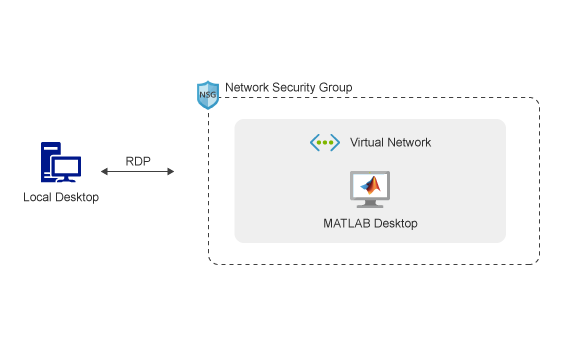

# MATLAB on Microsoft Azure (Linux VM)

# Requirements
Before starting, you will need the following:

- A MATLAB® license. For more information, see [Confirm Licensing for MathWorks Products Running on the Cloud](https://mathworks.com/help/install/license/licensing-for-mathworks-products-running-on-the-cloud.html).
- A [MathWorks Account](https://www.mathworks.com/login?uri=%2Fmwaccount%2F).
- A Microsoft Azure account.

# Costs
You are responsible for the cost of the Azure services used when you create cloud resources using this guide. Resource settings, such as instance type, will affect the cost of deployment. For cost estimates, see the pricing pages for each Azure service you will be using. Prices are subject to change.

# Introduction
The following guide will help you automate the process of running the MATLAB desktop on Microsoft Azure using a Linux virtual machine, and connect to it using the Remote Desktop Protocol (RDP). The automation is accomplished using an Azure Resource Manager (ARM) template. The template is a JSON
file that defines the resources needed to run MATLAB on Azure. For information about the architecture of this solution, see [Architecture and Resources](#architecture-and-resources).

# Deployment Steps

The MATLAB Reference Architecture is released with the twice-yearly general release schedule of MATLAB.
To view instructions for deploying the MATLAB reference architecture, select a MATLAB release:

| Release |
| ------- |
| [R2022a](releases/R2022a/README.md) |
| [R2021b](releases/R2021b/README.md) |
| [R2021a](releases/R2021a/README.md) |
| [R2020b](releases/R2020b/README.md) |
| [R2020a](releases/R2020a/README.md) |
| [R2019b](releases/R2019b/README.md) |
| [R2019a\_and\_older](releases/R2019a_and_older/README.md) |

# Architecture and Resources
Deploying this reference architecture will create several resources in your
resource group.

Deploying this reference architecture sets up a single Azure virtual machine running Linux and MATLAB, a network interface with a public IP address to connect to the virtual machine, a network security group that controls network traffic, and a virtual network for communication between resources.

To make deployment easy, a preconfigured Ubuntu virtual machine is provided. The VM image contains the following software:
* MATLAB, Simulink, Toolboxes, and support for GPUs.
To see a list of installed products, type `ver` at the MATLAB command prompt.

* Add-Ons: Deep Learning Toolbox(TM) Model for AlexNet Network, Deep Learning Toolbox Model for GoogLeNet Network, and Deep Learning Toolbox Model for ResNet-50 Network

### Resources

| Resource Name                     | Resource Name in Azure         | Number of Resources | Description                                                                                |
|-----------------------------------|-------------------------       |---------------------|--------------------------------------------------------------------------------------------|
| Virtual Machine                   | `matlab-vm`                    | 1                   | The virtual machine instance with pre-installed desktop MATLAB.                            |
| Network interface                 | `matlab-nic`                   | 1                   | Enables the virtual machine to communicate with internet, Azure, and on-premises resources.|
| Public IP address                 | `matlab-publicIP`              | 1                   | Public IP address to connect to the virtual machine running MATLAB.                        |
| Network security group            | `matlab-rdp-nsg`               | 1                   | Allows or denies traffic to and from sources and destinations.                             |
| Virtual network                   | `matlab-vnet`                  | 1                   | Enables resources to communicate with each other.                                          |
| Disk                              | `matlab-vm-disk-<unique id>`   | 1                   | The disk attached to the VM.                                                               |
| Image                             | `matlab-base-image`            | 1                   | The original image used to create the VM.                                                  |

## FAQ

### How do I save my changes in the VM?
All your files and changes are stored locally on the virtual machine.  They will persist until you either terminate the virtual machine instance or delete the resource group.  Stopping the instance does not destroy the data on the instance.  If you want your changes to persist before you terminate an instance, you’ll need to:
* copy your files to another location, or
* create an image of the virtual machine.

### What happens to my data if I shut down the instance?
You may want to shut down the instance when you aren’t using it.  Any files or changes made to the virtual machine will persist when shutting down and will be there when you restart.

### How do I save an image?
You can save a copy of your current virtual machine.  Locate the Azure VM in your resource group in the Azure Portal, click “Capture Image” and follow the instructions.

### How do I customize the image?
You can customize an image by launching the reference architecture, applying any changes you want to the virtual machine such as installing additional software, drivers and files and then saving an image of that virtual machine using the Azure Portal. For more information, see [How do I save an image?](#how-do-i-save-an-image). When you launch the reference architecture, click “Edit Template”, replace the `baseImageUri` in the “variables” section with the URL from your custom image. Save and finish the deployment steps by filling out parameters, accepting the terms and clicking “Create”.

### How do I use a different license manager?
The VM image uses MathWorks Hosted License Manager by default.  For information on using other license managers, see [Confirm Licensing for MathWorks Products Running on the Cloud](https://mathworks.com/help/install/license/licensing-for-mathworks-products-running-on-the-cloud.html).

### How do I deploy into an existing virtual network?
You will need to edit the template and replace the appropriate sections with your own virtual network and subnet resource ids.

# Technical Support
If you require assistance or have a request for additional features or capabilities, please contact [MathWorks Technical Support](https://www.mathworks.com/support/contact_us.html).