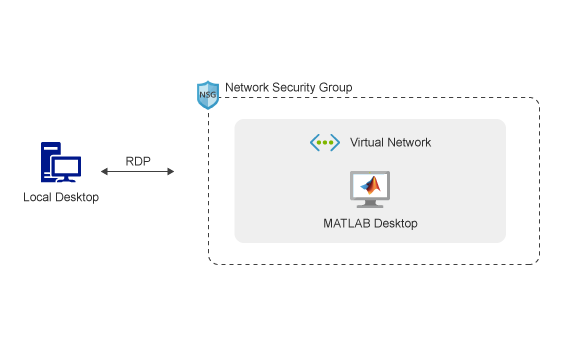

# MATLAB on Microsoft Azure

# Requirements
Before starting, you will need the following:

- A MATLAB® license. For more information, see [Configure MATLAB Licensing on the Cloud](http://www.mathworks.com/support/cloud/configure-matlab-licensing-on-the-cloud.html).
- A [MathWorks Account](https://www.mathworks.com/login?uri=%2Fmwaccount%2F).
- A Microsoft Azure account.

# Costs

You are responsible for the cost of the Azure services used when you create cloud resources using this guide. Resource settings, such as instance type, will affect the cost of deployment. For cost estimates, see the pricing pages for each Azure service you will be using. Prices are subject to change.

# Introduction
The following guide will help you automate the process of running the MATLAB desktop on Microsoft Azure and connect to it using the Remote Desktop Protocol (RDP). The automation is accomplished using an Azure Resource Manager (ARM) template. The template is a JSON
file that defines the resources needed to run MATLAB on Azure. For information about the architecture of this solution, see [Architecture and Resources](#architecture-and-resources).

# Choose a Deployment Option
- [Deploy MATLAB R2019b on Azure using Online Licensing](online-licensing-instructions.md)
- [Deploy MATLAB R2019b on Azure using Network Licensing](license-manager-instructions.md)

# Architecture and Resources
Deploying this reference architecture will create several resources in your
resource group.

Deploying this reference architecture sets up a single Azure virtual machine running Linux and MATLAB, a network interface with a public IP address to connect to the virtual machine, a network security group that controls network traffic, and a virtual network for communication between resources.

A preconfigured Ubuntu 18.04 VM is provided to make deployment easy. The VM image contains the following software:
* MATLAB, Simulink, Toolboxes, and support for GPUs.
To see a list of installed products, type `ver` at the MATLAB command prompt.

* Add-Ons: Neural Network Toolbox Model for AlexNet Network, Neural Network Toolbox Model for GoogLeNet Network, and Neural Network Toolbox(TM) Model for ResNet-50 Network

### Resources

| Resource Name                     | Resource Name in Azure  | Number of Resources | Description                                                                                |
|-----------------------------------|-------------------------|---------------------|--------------------------------------------------------------------------------------------|
| Virtual Machine                 | `matlab-vm`            | 1                   | The virtual machine instance with pre-installed desktop MATLAB.|
| Network interface                 | `matlab-nic`            | 1                   | Enables the virtual machine to communicate with internet, Azure, and on-premises resources.|
| Public IP address                 | `matlab-publicIP`       | 1                   | Public IP address to connect to the virtual machine running MATLAB.                        |
| Network security group            | `matlab-rdp-nsg`        | 1                   | Allows or denies traffic to and from sources and destinations.                             |
| Virtual network                   | `matlab-vnet`           | 1                   | Enables resources to communicate with each other.                                          |
| Disk                 | `matlab-vm-disk-<unique id>`            | 1                   | The disk attached to the VM.|
| Image                 | `matlab-base-image`            | 1                   | The original image used to create the VM.|

